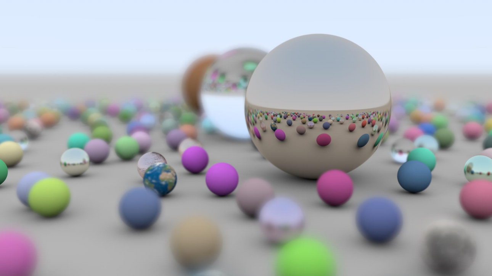

## Bienvenue !

Ce site constitue le résultat du travail de synthèse sur le Ray-Tracing temps réel, son actualité et futur. Cette étude de veille est réalisée dans le cadre d'un projet à l'École Centrale de Lyon.

## Introduction 

 
    Le Ray-tracing est une technique de rendu 3D bien connue et vieille depuis maintenant 40 ans ! Elle permet des rendues extrêmement réalistes. De plus l'implémentation du code de base reste très accessible et en fait souvent un exercice de choix dans les cursus informatiques. Cependant elle a toujours eu un certains retards par rapport à une autre technique de rendu 3D : la rastérisation. En effet, malgré la qualité ultra-réaliste obtenue grâce au Ray-Tracing, cette technique n'a été que peu, voir presque pas utilisée en temps réel du fait de son énorme consommation en ressources. Au début des années 2000, le Ray-Tracing a néanmoins commencé à être fortement utilisé dans l'industrie de l'animation/CGI, où le temps d'exécution des algorithmes est un problème moindre. Mais depuis quelques années, grâce au hardware de plus en plus performant, l'industrie du jeux vidéo a commencé à envisager le Ray-Tracing dans ses moteurs graphiques. 

 
  Avant de rentrer dans les détails techniques, commençons par analyser brièvement la rastérisation, ses atouts et ses limites et ainsi comprendre pourquoi le Ray-Tracing commence à entrer en jeu aujourd'hui.  

 
→ <a href="./rasterization.html"> Rastérisation </a>

## Sommaire
- [La rasterisation](./rasterization.md).
- [Le Ray Tracing](./raytracing.md).
- [Technique de Denoising](./rt_denoising.md).
- [Technologie RTX](./rtx.md).
- <a href="https://daniel-dht.github.io/VeilleECL/rtx.html#destinationLinkName">Futur du Ray Tracing temps réel </a>
