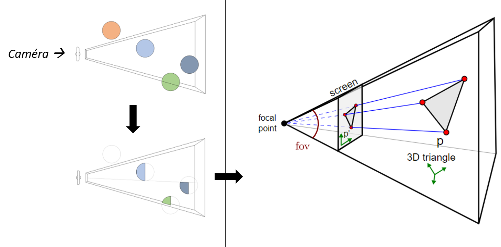

[Retour sommaire](./)

## Rasterisation 

 
La rasterisation est utilisée depuis les années 90, presque tous les jeux que vous connaissez sont rendue grâce à elle.. Nous ne creuserons pas les détails techniques derrières le rendu par rasterisation. Nous allons simplement essayer d'analyser quelles sont ses point forts et faibles, et donc de comprendre ce qu'ajouterai aujourd'hui le Ray-Tracing dans l'industrie du jeux vidéo.

 
La rasterisation consiste à mapper uniquement les points de l'espace 3D visibles depuis la caméra sur le plan 2D qui consituera l'image finale. Le schéma si dessous a pour but de d'expliquer simplement les étape clés.

 
La première image montre la scène 3D telle qu'imaginée dans le jeux. Sur la deuxième image, on a gardé seulement les points des objets 3D visibles depuis la position de la caméra. Puis finalemnt chacun de ces points est proheté sur un plan 2D.
La deuxième étape est la plus cruciale, dans le sens où c'est elle qui minimise de façon conséquente le nombre de triangle à afficher sur l'image finale, grâce à des algorythme de z-buffering, occlusion culling, etc. Aujourd'hui, en plus de produire des réusltats très satisfaisants, ces calculs sont extremement efficaces, parallèliséssur GPU et optimisés par 3 décennies de developpement.

 
Il y a cepedant une limite au réalise que peut atteindre la rasterisation. Comme on peut l'observer sur le schéma ce-dessus, seuls les objets visibles sont séléctionnés et mappés, toutes autres objets du monde 3D n'a aucun impact sur l'image finale: un objet à la surface réfléchissante ne pourrra projeter véritablement un objet en face de lui si celui-ci se trouve en dehors du champs de vision la caméra. Il existe évidemment des <i>hacks</i> qui permettent de simuler de tels effets, mais ceux-ci sont loin d'être réaliste. C'est là qu'intervient <a href="./raytracing.md"> le Ray-Tracing </a>. 

