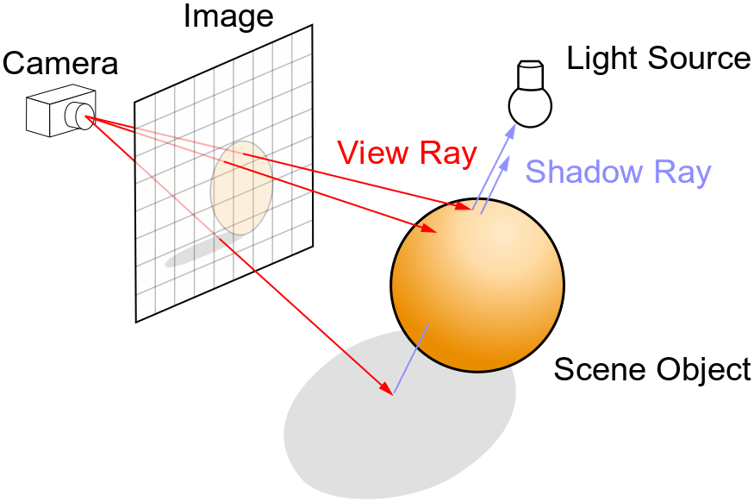
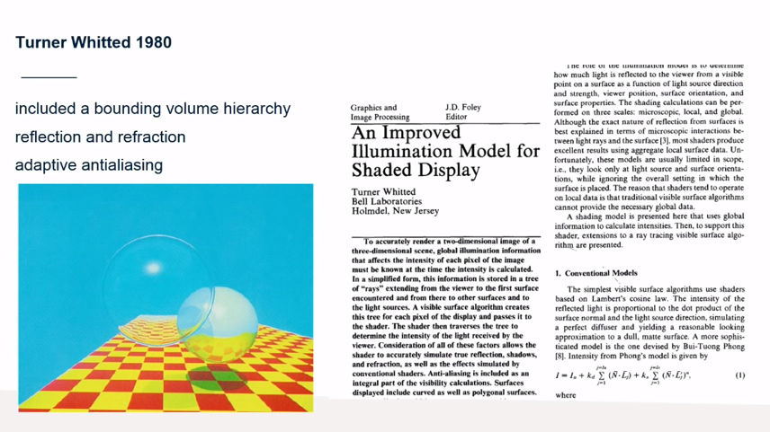
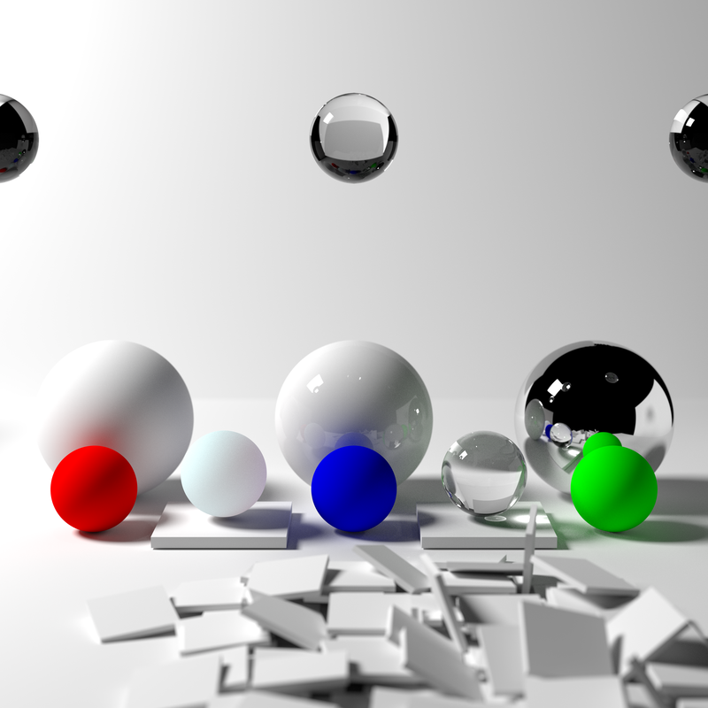
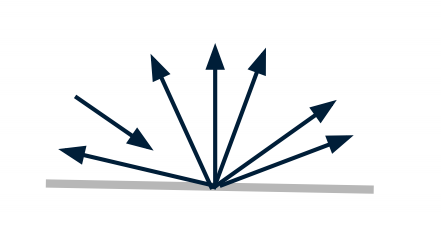
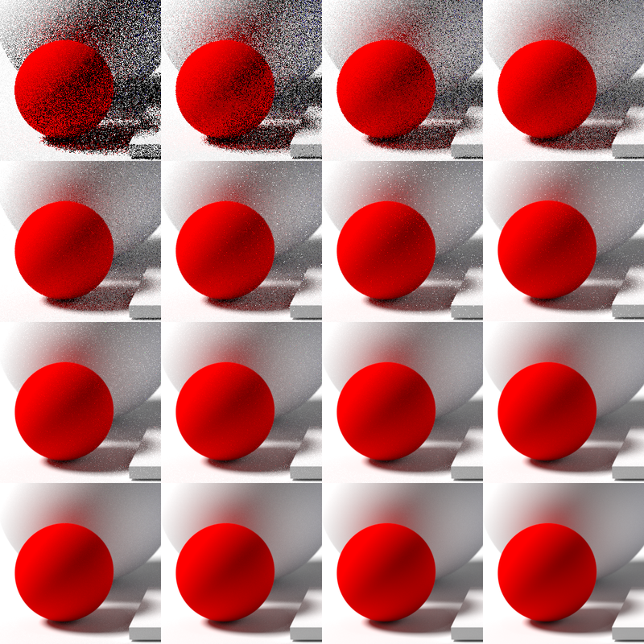
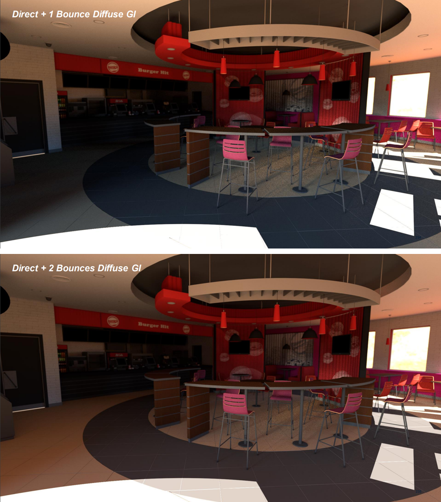

[Retour sommaire](./) 
<p>
<a href="./rt_denoising.html">Retour chapite Rastérisation </a>
</p>

## Ray Tracing 


<p style='text-align: justify;'> 
Ne réinventons pas la roue, et tenons-nous en à wikipedia pour ce qui est des définitions :
</p>

<p style='text-align:justify; background-color:#f3f6fa'> 
  «Le ray tracing (« lancer de rayons » en français) est une technique de calcul d'optique par ordinateur, utilisée pour le rendu en synthèse d'image ou pour des études de systèmes optiques. Elle consiste à simuler le parcours inverse de la lumière : on calcule les éclairages de la caméra vers les objets puis vers les lumières, alors que dans la réalité la lumière va de la scène vers l'œil.»
</p>

<p align="center"></p>

<p style='text-align: justify;'> 
Un rayon n'est rien d'autre qu'une droite qu'on définit par un point (l'origine du rayon) et un vecteur directeur.
Sur le schéma ci-dessus, la grille représente notre image finale. Dans le monde 3D, elle se représente par un plan situé entre notre caméra et la scène à visualiser. Chaque cellule de la grille représente un pixel. Pour colorer un pixel, on  "lance" un rayon ayant pour ori gine la caméra et pour direction le pixel, la couleur de celui-ci sera définie par les matériaux des objets de la scène intersectés par le rayon. Le calcul d'intersection se fait simplement en résolvant le système d'equations droite/sphère ou droite/triangle avec les coordonnées barycentriques du triangle.
</p>

Pour faire le parallèle avec la rastérisation:
- la rastérisation amène les objets jusqu'au pixel.
- le ray tracing amène le pixel jusqu'aux objets.

Le papier précurseur de tout cela est de Turner Whitted, et date de 1980. Les techniques que l'on connait et utilise aujourd'hui en sont déjà en bonne partie tirées, même les structures d'accélération que l'on retrouve dans les dernières technologies Nvidia/RTX.

<p align="center"></p>

Deux autres papiers ont suivies les années suivantes, et vont ajouter la composante aléatoire du ray tracing.
- Cook, 1984: ajout des ombres douces
- Kajiya 1986: ajout de l'illumination globale

<p style='text-align: justify;'> 
On parle aussi de Path-Tracing quand on ajoute l'illumination globale au Ray-Tracing. On obtient alors des images d'un réalisme exceptionnel, mais aussi une consommation de ressource considérablement augmentée.
</p>

<p align="center"></p>

<p style='text-align: justify;'> 
Toute l'idée derrière le ray tracing est donc décrite dans ces 3 papiers, et il n'y pas eu de véritable révolution de l'algorithme de base depuis. Comme on l'a vu précédemment, malgré son rendu remarquable, le ray tracing à toujours été à la traine derrière la rastérisation du fait de sa consommation de ressources. Les ajouts qui en feront potentiellement le remplaçant de la rastérisation sont surtout des ajouts extérieurs à la technique de base, comment du meilleur materiel hardware par exemple. Mais avant cela, regardons de plus près le mécanisme d'illumination globale qui permet d'obtenir de si bons rendus.
</p>

### Illumination globale


<p style='text-align: justify;'> 
Il s'agit maintenant de bien comprendre ce qu'il se passe quand on parle d'illumination global, et pourquoi est-ce si gourmand à l'execution. 
</p>
<p style='text-align: justify;'> 
Si l'on se réfère au premier schéma, on comprend qu'un pixel ne sera colorié de la couleur de l'objet intersecté que si le rayon (shawdow ray) entre le point d'intersection et la source de lumière n'est pas lui-même intersecté par d'autre obstacle. Cette modélisation ne prend donc pas en compte le fait que la lumière puisse rebondir sur les objets de façon infinie et dans n'importe quelle direction. La technique d'illumination globale permet cela: à chaque impact, le rayon va rebondir une nouvelle fois, dans une direction aléatoire incluse dans l'hémisphère porté par la normale au point d'intersection.
</p>

<p align="center"></p>

<p style='text-align: justify;'> 
Pour bien approximer l'ensemble des rayons de cet hémisphère, il faut envoyer suffisamment de rayons, sinon l'image sera bruitée. Pour chaque pixel, on va donc envoyer plusieur rayons: on obtient généralement un résultat acceptable pour au moins 100 rayons/pixel. Ci dessous un exemple de la même image généré avec respectivement 1, 2, 4, 8, 16, etc.. rayons/pixels
</p>

<p align="center"></p>

<p style='text-align: justify;'> 
L'opération doit en plus être répétée à chaque rebond, pour que la lumière puisse vraiment parcourir toute la scène, et que les objets réfléchissent la lumière qu'ils reçoivent sur les autres. Ci dessous un exemple avec respectivement 1 et 2 rebonds par rayons.
</p>

<p align="center"></p>

<p style='text-align: justify;'> 
Pour converger vers l'image finale nette, il faut donc plusieurs centaines, voir milliers de rayons par pixel. Même porté sur GPU et très bien optimisé, cela n'est pas faisable et prends plusieurs secondes de calculs pour des scènes bien fournies. D'autant plus que contrairement à la rastérisation, doubler la résolution de l'image est fatale pour le raytracing. Il faut donc trouver d'autres méthodes pour se rapprocher du temps réel, qui demande un minimum de 16 millisecondes par image pour obtenir un 60 FPS décent. 

Une première méthode consiste à débruiter les images, et de ne se contenter que de quelques rayons par pixels:
 <a href="./rt_denoising.html"> Technique de denoising temps réel </a>. 
</p>


### Pseudo code simple de Ray-Tracing avec illumination globale

<details>
  
<summary>Voici un pseudo code simple de Ray Tracing avec illumination globale</summary>


```cpp
  Color TracePath(Ray ray, count depth) {
    if (depth >= MaxDepth) {
      return Black;  // Bounced enough times.
    }

    ray.FindNearestObject();
    if (ray.hitSomething == false) {
      return Black;  // Nothing was hit.
    }

    Material material = ray.thingHit->material;
    Color emittance = material.emittance;

    // Pick a random direction from here and keep going.
    Ray newRay;
    newRay.origin = ray.pointWhereObjWasHit;

    // This is NOT a cosine-weighted distribution!
    newRay.direction = RandomUnitVectorInHemisphereOf(ray.normalWhereObjWasHit);

    // Probability of the newRay
    const float p = 1/(2*M_PI);

    // Compute the BRDF for this ray (assuming Lambertian reflection)
    float cos_theta = DotProduct(newRay.direction, ray.normalWhereObjWasHit);
    Color BRDF = material.reflectance / M_PI ;

    // Recursively trace reflected light sources.
    Color incoming = TracePath(newRay, depth + 1);

    // Apply the Rendering Equation here.
    return emittance + (BRDF * incoming * cos_theta / p);
  }

  void Render(Image finalImage, count numSamples) {
    foreach (pixel in finalImage) {
      foreach (i in numSamples) {
        Ray r = camera.generateRay(pixel);
        pixel.color += TracePath(r, 0);
      }
      pixel.color /= numSamples;  // Average samples.
    }
  }
```

</details>
