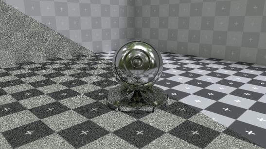
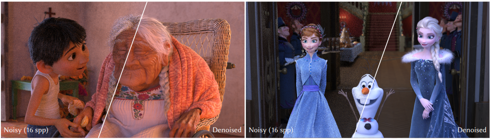

[Retour sommaire](./) 

<a href="./raytracing.html"> Retour chapitre Ray Tracing </a>. 

## Débruitage appliqué au Ray Tracing

 
Comme on l'a vu précedemment, le ray tracing avec illumination gloabal (méthode de Monte Carlo) ne converge pas vers des images nettes sans un nombre conséquent de rayons lancés par pixel. Si l'on se place dans un contexte temps réel, e.g un temps de calcul par image inferieur à 16 ms, les images seront forcément bruitées. 

 
La technique de denoising consiste donc à ne lancer que quelques rayons par pixel, et d'appliquer des filtres sur l'image bruitée. Cela fait plusieurs années (début des années 2010) que le sujet est creusé par de nombreuses recherches, notemment l'industrie du cinéma d'animation, où la grande qualité des images et le complexité des scènes necessitent parfois jusqu'à des dizaines d'heures par image. Les studios Disney ont sortie de nombreux papiers depuis (https://studios.disneyresearch.com/category/rendering/).

 
Cependant, ces recherches n'avaient pas pour objectif un rendu temps réel, et les algorithmes developpé rendent des images souvent dans un ordre de grandeur de une à 10 minutes par image. EN 2017, NVidia, très impliquée dans la course au Ray Tracing temps réel, a sortie un résultat de recherche présentant un denoising temp réel à un seul rayon/pixel avec une qualité comparable à un rendu à 2000 rayons/pixel. Le résultat est visible sur la vidéo ci-dessous de <i>Two Minutes Papers</i>.

  . 

 
En voyant cela, il est difficile de croire qu'il soit possible de passer d'un tel bruit à une image nette, cependant il faut garder à l'esprit que le bruit est seulement du à la composante de lumière indirecte: Sans illumination globale, l'image n'est certes pas parfaites en termes de jeu de lumière, mais il n'y a aucun bruit. La technique consiste donc à passer ne filter la composante indirecte que sur les zones de pixel correspondant aux zones homhènes de l'image nette. Les <i> sharp egdes </i> sont donc préservés, et il moins de flou se trouve introduit. En plus de cela, le filtre est aussi temporel: les données des rayons lancés dans pour générer une <i>frame</i> sont réutilisées pour générer les frames suivantes. L'IA a une part importnte à jouer dans les filtres appliqués, qui sont contitués de réseaux de convolution, d'auto-encoder, etc.

 
Depuis de nombreux autres recherches continuent d'améliorer ces résultats. Le blog de Alain Galvan, <i>Graphics Software Engineer</i>, https://alain.xyz/blog/raytracing-denoising, recense de manière approfondie toutes les techniques et performances actuelles de la recherche sur le sujet. <i>Sampling Techniques</i>, <i>Sobol Sequences</i>, <i>Spatio-Temporal Techniques</i>, <i>Motion Buffer</i>, <i>Bluring Kernels</i>, <i>Firefly Rejection</i> pour les intéréssés.

 
Malgrés cela, des imperfections et la technologie n'est pas encore totalement prête. De plus, l'industrie du jeux vidéo n'est pas près d'abandonné la rastérisation et ses qualités. Aujourd'hui, en mars 2020, quand on parle de ray tracing dans le jeux vidéo, on parle surtout de <a href="./rtx.html"> la technologie RTX. </a>. 

