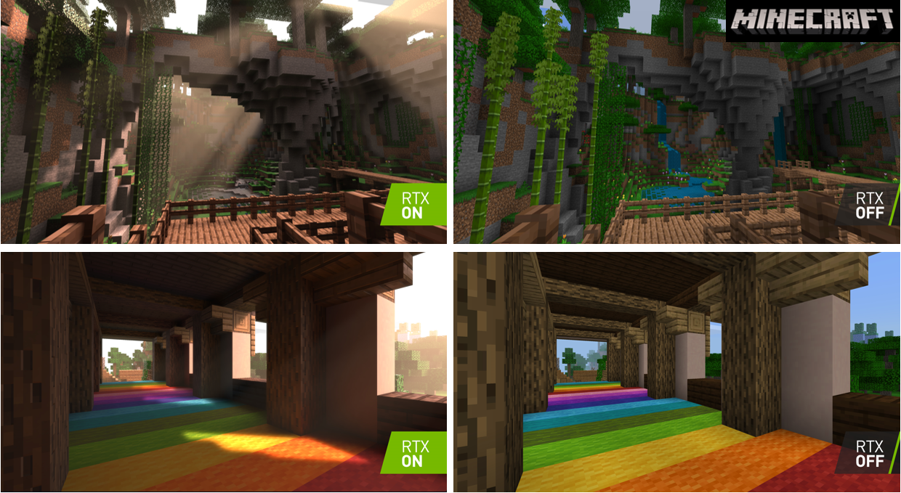
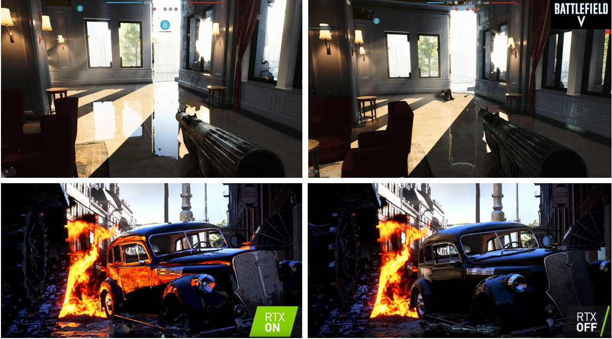
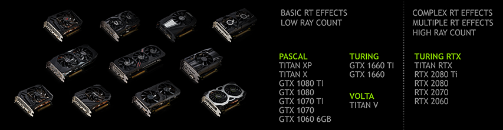

[Retour sommaire](./) 

<a href="./rt_denoising.html"> Retour chapitre Débruitage </a>. 

## Technologie RTX 

 
  En 2018, Microsoft annonce la sortie de DirectX Raytracing à la GDC (Game Developers Conference). C'est cette sortie qui va permettre l'implémentation du ray tracing dans les grosses licences  sorties les deux dernières années comme Battlefield 5 ou Minecraft.

 

 
  Microsoft DirectX est une collection de bibliothèques destinées à la programmation d’applications multimédia, plus particulièrement de jeux ou de programmes faisant intervenir de la vidéo, sur les plates-formes Microsoft (Xbox, systèmes d’exploitation Windows). Sortie en 1995, DirextX est aujourd'hui largement répandue et utilisée dans la plupart des moteurs de jeux. 

 
  DirextX Raytracing (DXT) a été développé en Collaboration avec NVidia, et constitue une extension de DirectX 12. C'est donc une pierre de plus à l'édifice d'API déjà déployées comme Direct3D. Le but de DXT est donc de pourvoir aux développeurs une API simple encapsulant les élément de base de L'algorithmie du Ray tracing, en portant le tout sur GPU. Cette API comprend :
  
- une mise en place simple de pipeline de shader HSLS
- des intersections rayon/triangle optimisés
- des structures d'accélération type BVH (Bounding volume hierarchy)
- une encapsulation de la gestion complexe d'accès mémoire et transfert de données GPU/CPU
  
Mais le principal atout est la synergie rasterisation/ray tracing qu'offre DXT. En effet, comme on l'a vu précédemment, on ne peut pas se passer de la rastérisation aujourd'hui, et même si on le pourrait dans les prochaines années, seules les meilleurs (et plus onéreuses) cartes graphiques seraient à même de supporter un ray tracing complet. Ainsi, il faut pourvoir mixer les deux technologies, et c'est ce qu'apporte DXR. Une des applications possible est de calculer le rendu sans ombres grâce à la rastérisation, et d'implémenter celles-ci grâce au ray racing. Il en va de même pour les surface transparente ou réfléchissantes : on détermine sur quels pixel de l'image les rayons doivent être lancés grâce à la rastérisation pour ensuite laisser place au raytracing.

 
Un autre atout pour Microsoft est le timing de la sortie d prochaine XBox, qui pourra bénéficier de la technologie DXT. Plusieurs vidéos sont disponibles en ligne (liens ci-dessous), faisant l'étalage des possibilités offertes par DXT. 

 <i>SEED, Electronic Arts :</i>

  

 <i>EPIC, with collaboration from ILMxLAB and NVIDIA : </i> 
  

 
  .

 
  La technologie RTX mise en avant par Nvidia est une plateforme de développement spécifiquement dédié au raytracing pilotable depuis DirextX. C'est cette technologie à la base des images que l'on peut voir circulé un peu partout sur internet, et qui font grands bruits sur les grosses licences telles que Minecraft. On a la possibilité d'activer ou non le Ray Tracing. Si on le fait c'est souvent au détriment du nombre de FPS, mais comme on peut le voir sur les images ci-dessous, on obtient un gain significatif de réalisme, notamment sur les reflets.

 
Néanmoins, toutes les cartes graphiques ne sont pas capables de supporter le RTX:

 
En effet le futur du raytracing est fortement hardware dépendant, et aujourd'hui, pour bénéficier de toutes les capacités RTX, les cartes graphiques doivent avoir des cores dédiées. Faisant d'une pierre deux coups, étant donné que l'IA a de mêmes problématiques de calculs, NVidia a mis en place des cores dédiées, RT core et Tensor core, spécifiquement conçues les tâches de raytracing et d'IA. Pour le moment, ces cartes sont chères, plus de 1000 euros pour certaines, ce qui constituera un frein au développement de la technologie pendant quelque temps.

## Conclusion

Les atouts qu'apporterait le Raytracing dans le jeux vidéos sont indéniables, on y retrouve :

- des scènes hyper réalistes
- des ombres et des réflexions réelles et quasiment parfaites
- un gain de temps pour les artistes sur la modélisation des scènes et de l’interaction objet/lumière

De plus, ce réalisme a aussi une grande importance dans l'industrie du design et de l'architecture pour la conception des maquettes et en tant qu'outil marketing.

Cependant, il reste des limites solides dans la course au ray Tracing temps réel :
- d'importante pertes de FPS
- des scènes parfois trop sombres
- un coût matériel élevé pour l'achat des GPU compatibles
- on peut imaginer dans le futur que certains jeux ne soient simplement plus jouables sur des configurations classiques.

Pour le moment, les principaux axes de recherches se basent donc sur le denoising ainsi que l'amélioration de la synergie Rastérisation/Ray-Tracing.

## Références

PCGamer, Ray tracing in today games, https://www.pcgamer.com/what-is-ray-tracing/

Microsoft, dirextX raytracing announce, https://devblogs.microsoft.com/directx/announcing-microsoft-directx-raytracing/

NVidia, BRIAN CAULFIELD, https://blogs.nvidia.com/blog/2018/03/19/whats-difference-between-ray-tracing-rasterization/

NVidia, https://www.nvidia.com/en-us/geforce/news/geforce-gtx-dxr-ray-tracing-available-now/

NVidia, https://developer.nvidia.com/rtx/raytracing/dxr/DX12-Raytracing-tutorial-Part-1

